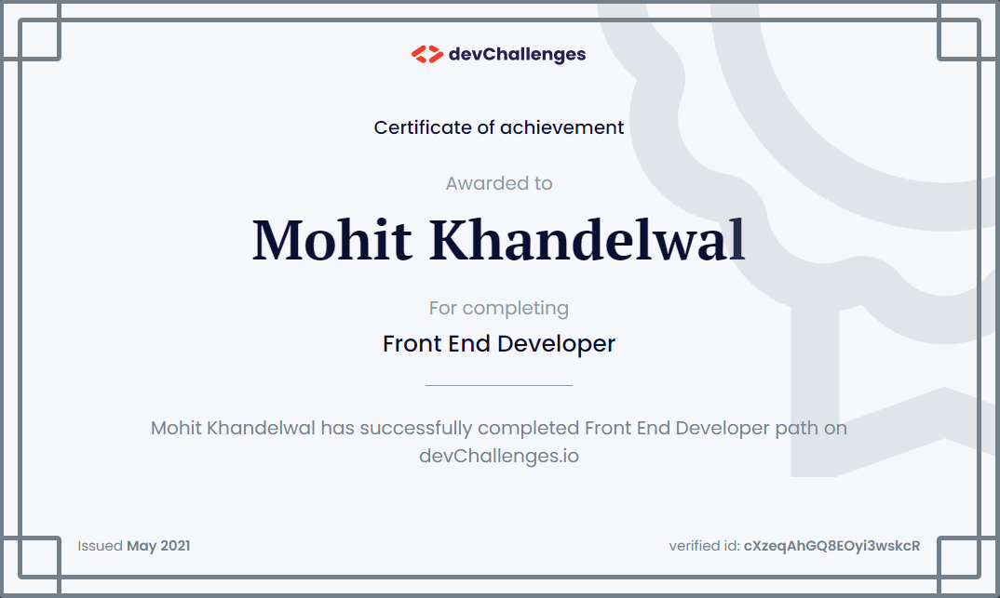
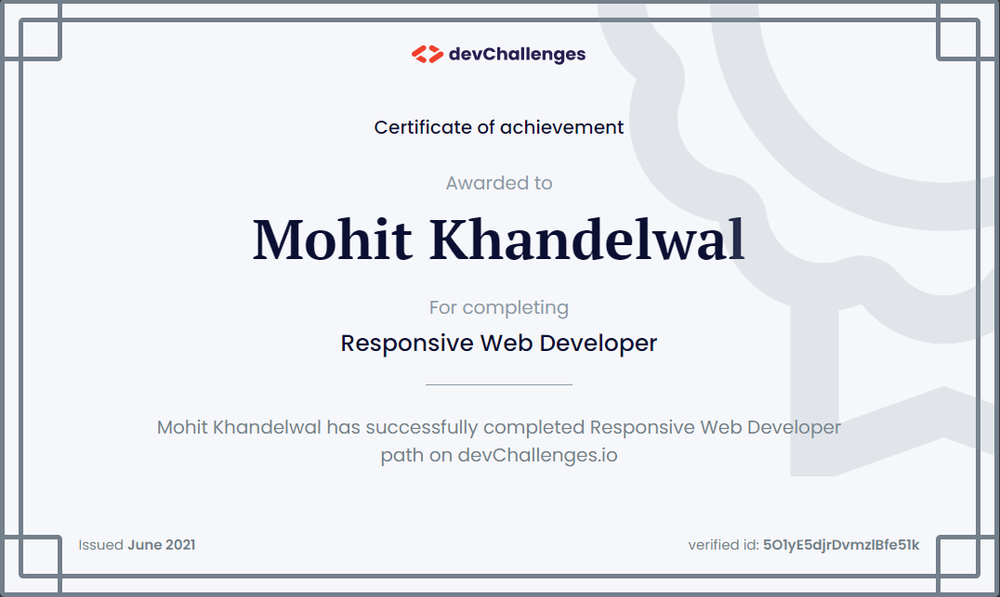

## Devchallenges Solutions
[Devchallenges](https://devchallenges.io/) is a community challenge for anyone who wants to enhance software development skills by building real-life projects and solving practical tasks. 

##### How this works?
Devchallenges has total 24 challenges/projects of various difficulty levels. Projects are divided in 3 paths - responsive, front-end and full-stack. Each project has detailed user stories along with UI design.

##### Where can you see my work?
You can view my [devchallanges portfolio](https://devchallenges.io/portfolio/mohitkh7).

##### what inspired me to take this challenge? 
To learn new stuff, improve my skills and build portfolio of cool projects.

##### What I have learned/improved?
Solving this challenge is a great learning experience for me. Now I feel myself more confident as a software developer. Some of the key stuffs that I have learned are:
- CSS layout techniques: Flex-Box & Grid-Box
- CSS media query
- Block-Element-Modifier (BEM) principal
- Angular router reuse strategy
- CORS proxy with angular http interceptor

### Solutions
- Responsive web developer path
    1. [404 Not Found](https://github.com/mohitkh7/devchallenges-solution/tree/master/responsive-web-developer/challenge1-404-not-found)
    2. [My Team](https://github.com/mohitkh7/devchallenges-solution/tree/master/responsive-web-developer/challenge2-my-team)
    3. [Interior Consultant](https://github.com/mohitkh7/devchallenges-solution/tree/master/responsive-web-developer/challenge3-interior-consultant)
    4. [Recipe Page](https://github.com/mohitkh7/devchallenges-solution/tree/master/responsive-web-developer/challenge4-recipe-page)
    5. [My Gallery](https://github.com/mohitkh7/devchallenges-solution/tree/master/responsive-web-developer/challenge5-my-gallery)
    6. [Checkout Page](https://github.com/mohitkh7/devchallenges-solution/tree/master/responsive-web-developer/challenge6-checkout-page)
    7. [Edie Homepage](https://github.com/mohitkh7/devchallenges-solution/tree/master/responsive-web-developer/challenge7-edie-homepage)
    8. [Portfolio](https://github.com/mohitkh7/devchallenges-solution/tree/master/responsive-web-developer/challenge8-portfolio)
- Front-end developer path
    1. [Button Component](https://github.com/mohitkh7/devchallenges-solution/tree/master/front-end-developer/projects/challenge1-button-component)
    2. [Input Component](https://github.com/mohitkh7/devchallenges-solution/tree/master/front-end-developer/projects/challenge2-input-component)
    3. [Windbnb](https://github.com/mohitkh7/devchallenges-solution/tree/master/front-end-developer/projects/challenge3-windbnb)
    4. [Todo App](https://github.com/mohitkh7/devchallenges-solution/tree/master/front-end-developer/projects/challenge4-todo-app)
    5. [Quote Generator](https://github.com/mohitkh7/devchallenges-solution/tree/master/front-end-developer/projects/challenge5-quote-generator)
    6. [Quiz App](https://github.com/mohitkh7/devchallenges-solution/tree/master/front-end-developer/projects/challenge6-quiz-app)
    7. [Weather App](https://github.com/mohitkh7/devchallenges-solution/tree/master/front-end-developer/projects/challenge7-weather-app)
    8. [Jobs App](https://github.com/mohitkh7/devchallenges-solution/tree/master/front-end-developer/projects/challenge8-jobs-app)
- Full-stack developer path
    1. Image Uploader
    2. My Unsplash
    3. CatWiki
    4. Authentication App
    5. Shoppingify
    6. Chat Group
    7. Tweeter - Twitter Clone
    8. Thullo - Trello Clone

### Certificates

### Contributing
Contributions are what make open source community such an amazing place to be learn, inspire and create. Any contributions you make are **greatly appreciated**. Some of the ways in which you can contribute:
- Giving feedback
- Suggesting enhancements
- Reporting bugs

### Contact
Send me an email at mohitkh7@gmail.com or connect with me on Linkedin [Mohit Khandelwal](https://linkedin.com/in/mohitkh7).