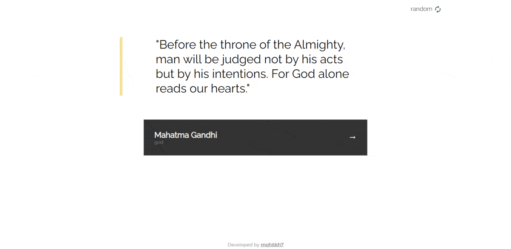

<!-- Please update value in the {}  -->

<h1 align="center">Random Quote Generator</h1>

   Solution for a challenge from  <a href="http://devchallenges.io" target="_blank">Devchallenges.io</a>.

  <h3>
    <a href="https://mohitkh7-devchallenge-solution.web.app/front-end-developer/challenge5-quote-generator/">
      Demo
    </a>
     | 
    <a href="https://github.com/mohitkh7/devchallenges-solution/tree/master/front-end-developer/challenge5-quote-generator/">
      Solution
    </a>
     | 
    <a href="https://devchallenges.io/challenges/8Y3J4ucAMQpSnYTwwWW8">
      Challenge
    </a>
  </h3>

<!-- TABLE OF CONTENTS -->

## Table of Contents

- [Overview](#overview)
  - [Built With](#built-with)
- [Features](#features)
- [Acknowledgements](#acknowledgements)
- [Contact](#contact)

<!-- OVERVIEW -->

## Overview

Famous quotes can be a great source of motivation. This application displays a random quote from a large pool of quotes available. You can also view all available quotes from a specific personality.

### Built With

<!-- This section should list any major frameworks that you built your project using. Here are a few examples.-->

- [Angular](https://angular.io)
- [Typescript](https://typescriptlang.org)
- [Karma](https://karma-runner.github.io/latest/index.html)
- [Jasmine](https://jasmine.github.io/)
- [HTML](https://developer.mozilla.org/en-US/docs/Web/HTML)
- [CSS](https://developer.mozilla.org/en-US/docs/Web/CSS)

## Features

<!-- List the features of your application or follow the template. Don't share the figma file here :) -->

This application/site was created as a submission to a [DevChallenges](https://devchallenges.io/challenges) challenge. The [challenge](https://devchallenges.io/challenges/8Y3J4ucAMQpSnYTwwWW8) was to build an application to complete the given user stories.
- I can add a new task
- I can see a random quote
- I generate a new random quote
- When I select quote author, I can see a list of quotes from them
- I can see quote genre under the author

## Acknowledgements

<!-- This section should list any articles or add-ons/plugins that helps you to complete the project. This is optional but it will help you in the future. For exmpale -->

- [Quote Garden API](https://github.com/pprathameshmore/QuoteGarden)
- [Firebase](https://firebase.google.com/) for hosting

## Contact

- Website [mohitkh7.github.io](http://mohitkh7.github.io/)
- GitHub [@mohitkh7](https://github.com/mohitkh7)
- Linkedin [Mohit Khandelwal](https://www.linkedin.com/in/mohitkh7)