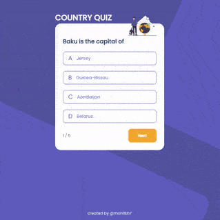

<!-- Please update value in the {}  -->

<h1 align="center">Quiz App</h1>

   Solution for a challenge from  <a href="http://devchallenges.io" target="_blank">Devchallenges.io</a>.

  <h3>
    <a href="https://mohitkh7-devchallenge-solution.web.app/front-end-developer/challenge6-quiz-app/">
      Demo
    </a>
     | 
    <a href="https://github.com/mohitkh7/devchallenges-solution/tree/master/front-end-developer/projects/challenge6-quiz-app/">
      Solution
    </a>
     | 
    <a href="https://devchallenges.io/challenges/Bu3G2irnaXmfwQ8sZkw8">
      Challenge
    </a>
  </h3>

<!-- TABLE OF CONTENTS -->

## Table of Contents

- [Overview](#overview)
  - [Built With](#built-with)
- [Features](#features)
- [Acknowledgements](#acknowledgements)
- [Contact](#contact)

<!-- OVERVIEW -->

## Overview

Country quiz app is an exciting app to test your knowledge of countries around the world. You will get 5 questions based on capital or flag of a country and you will have to identify correct country from 4 options. 

### Built With

<!-- This section should list any major frameworks that you built your project using. Here are a few examples.-->

- [Angular](https://angular.io)
- [Typescript](https://typescriptlang.org)
- [HTML](https://developer.mozilla.org/en-US/docs/Web/HTML)
- [CSS](https://developer.mozilla.org/en-US/docs/Web/CSS)

## Features

<!-- List the features of your application or follow the template. Don't share the figma file here :) -->

This application/site was created as a submission to a [DevChallenges challenge](https://devchallenges.io/challenges/Bu3G2irnaXmfwQ8sZkw8). The application completes the given user stories.

- [x] I can see 2 types of questions: a city is the capital of, or a flag belong to country
- [x] I can select an answer
- [x] I can see if my answer if correct or incorrect
- [x] I can see the correct answer in case my answer is wrong
- [x] I can view the result at the end of quiz and try again

## Acknowledgements

- [Firebase](https://firebase.google.com/) for hosting
- [Restcountries.eu](https://restcountries.eu/) for API on country data

## Contact

- Website [mohitkh7.github.io](http://mohitkh7.github.io/)
- GitHub [@mohitkh7](https://github.com/mohitkh7)
- Linkedin [Mohit Khandelwal](https://www.linkedin.com/in/mohitkh7)
