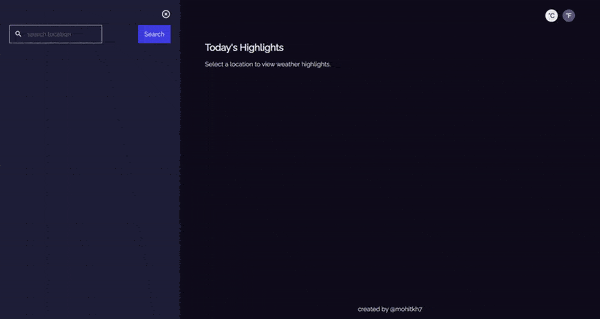

<!-- Please update value in the {}  -->

<h1 align="center">Weather App</h1>

   Solution for a challenge from  <a href="http://devchallenges.io" target="_blank">Devchallenges.io</a>.

  <h3>
    <a href="https://mohitkh7-devchallenge-solution.web.app/front-end-developer/challenge7-weather-app/">
      Demo
    </a>
     | 
    <a href="https://github.com/mohitkh7/devchallenges-solution/tree/master/front-end-developer/projects/challenge7-weather-app/">
      Solution
    </a>
     | 
    <a href="https://devchallenges.io/challenges/mM1UIenRhK808W8qmLWv">
      Challenge
    </a>
  </h3>

<!-- TABLE OF CONTENTS -->

## Table of Contents

- [Overview](#overview)
  - [Built With](#built-with)
- [Features](#features)
- [How to use](#how-to-use)
- [Contact](#contact)
- [Acknowledgements](#acknowledgements)

<!-- OVERVIEW -->

## Overview

Weather app is an interactive angular application which gives weather details of cities around the world. This application is developed as mobile first design following BEM principles. It uses HTML5 geolocation apis to get current location of user.

### Built With

<!-- This section should list any major frameworks that you built your project using. Here are a few examples.-->

- [Angular](https://angular.io)
- [Typescript](https://typescriptlang.org)
- [HTML](https://developer.mozilla.org/en-US/docs/Web/HTML)
- [CSS](https://developer.mozilla.org/en-US/docs/Web/CSS)

## Features

<!-- List the features of your application or follow the template. Don't share the figma file here :) -->

This application/site was created as a submission to a [DevChallenges](https://devchallenges.io/challenges) challenge. The [challenge](https://devchallenges.io/challenges/mM1UIenRhK808W8qmLWv) was to build an application to complete the given user stories.
- [x] I can see city weather as default, preferably my current location
- [x] I can search for city
- [x] I can see weather of today and the next 5 days
- [x] I can see the date and location of the weather
- [x] I can see according to image for each type of weather
- [x] I can see the min and max degree each day
- [x] I can see wind status and wind direction
- [x] I can see humidity percentage
- [x] I can see a visibility indicator
- [x] I can see the air pressure number
- [x] I can request my current location weather
- [x] I can convert temperature in Celcius to Fahrenheit and vice versa

## Acknowledgements

<!-- This section should list any articles or add-ons/plugins that helps you to complete the project. This is optional but it will help you in the future. For example: -->

- [Firebase](https://firebase.google.com/) for hosting
- [API-Metaweather](https://www.metaweather.com/api/) for weather data APIs
- [allOrigins](https://allorigins.win/) for CORS proxy

## Contact

- Website [mohitkh7.github.io](http://mohitkh7.github.io/)
- GitHub [@mohitkh7](https://github.com/mohitkh7)
- Linkedin [Mohit Khandelwal](https://www.linkedin.com/in/mohitkh7)
