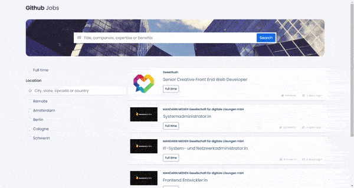

<!-- Please update value in the {}  -->

<h1 align="center">Jobs App</h1>

   Solution for a challenge from  <a href="http://devchallenges.io" target="_blank">Devchallenges.io</a>.

  <h3>
    <a href="https://mohitkh7-devchallenge-solution.web.app/front-end-developer/challenge8-jobs-app/">
      Demo
    </a>
     | 
    <a href="https://github.com/mohitkh7/devchallenges-solution/tree/master/front-end-developer/challenge8-jobs-app/">
      Solution
    </a>
     | 
    <a href="https://devchallenges.io/challenges/TtUjDt19eIHxNQ4n5jps">
      Challenge
    </a>
  </h3>

<!-- TABLE OF CONTENTS -->

## Table of Contents

- [Overview](#overview)
  - [Built With](#built-with)
- [Features](#features)
- [How to use](#how-to-use)
- [Contact](#contact)
- [Acknowledgements](#acknowledgements)

<!-- OVERVIEW -->

## Overview

Jobs search app is an interactive angular application which shows job openings around the world. You can easily search for any keyword or filter jobs on based on location.

### Built With

<!-- This section should list any major frameworks that you built your project using. Here are a few examples.-->

- [Angular](https://angular.io)
- [Typescript](https://typescriptlang.org)
- [HTML](https://developer.mozilla.org/en-US/docs/Web/HTML)
- [CSS](https://developer.mozilla.org/en-US/docs/Web/CSS)
- [Bootstrap](https://getbootstrap.com/docs/5.0/getting-started/introduction/)

## Features

<!-- List the features of your application or follow the template. Don't share the figma file here :) -->

This application/site was created as a submission to a [DevChallenges](https://devchallenges.io/challenges) challenge. The [challenge](https://devchallenges.io/challenges/TtUjDt19eIHxNQ4n5jps) was to build an application to complete the given user stories.
- [x] I can see a list of all jobs by default
- [x] I can search for jobs with a given keyword
- [x] I can search for jobs with a city name, zip code, or other location
- [x] I can select one option from at least 4 pre-defined options
- [x] I can search for a full-time job only
- [x] I can see a list of jobs with their logo, company name, location, and posted time.
- [x] When I select a job, I can see job descriptions and how to apply.
- [x] When I am on the job details page, I can go back to the search page
- [x] I can see jobs on different pages, 5 items on each page

## Acknowledgements

<!-- This section should list any articles or add-ons/plugins that helps you to complete the project. This is optional but it will help you in the future. For example: -->

- [Firebase](https://firebase.google.com/) for hosting
- [Github Jobs API](https://jobs.github.com/api) for jobs API
- [allOrigins](https://allorigins.win/) for CORS proxy
- [Ngx-Pagination](https://www.npmjs.com/package/ngx-pagination)
- [Implement routeReuseStrategy - Stackoverflow](https://stackoverflow.com/questions/41280471/how-to-implement-routereusestrategy-shoulddetach-for-specific-routes-in-angular)

## Contact

- Website [mohitkh7.github.io](http://mohitkh7.github.io/)
- GitHub [@mohitkh7](https://github.com/mohitkh7)
- Linkedin [Mohit Khandelwal](https://www.linkedin.com/in/mohitkh7)
