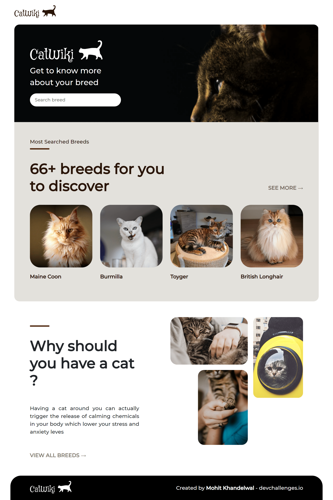
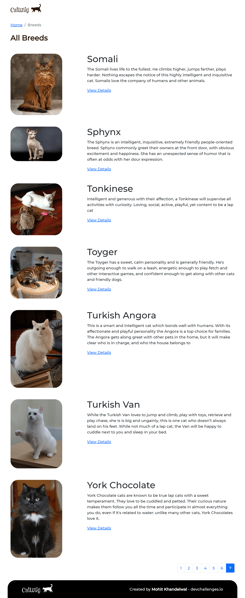
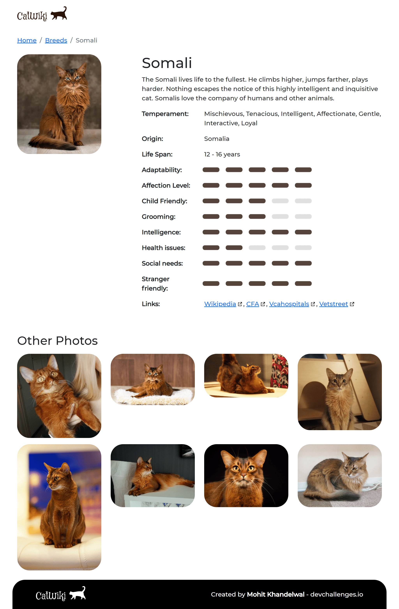

<!-- Please update value in the {}  -->

<h1 align="center">Cat Wiki</h1>

   Solution for a challenge from  <a href="http://devchallenges.io" target="_blank">Devchallenges.io</a>.

  <h3>
    <a href="https://mohitkh7-devchallenge-solution.web.app/full-stack-developer/challenge3-cat-wiki/">
      Demo
    </a>
     | 
    <a href="https://github.com/mohitkh7/devchallenges-solution/tree/master/full-stack-developer/challenge3-cat-wiki/">
      Solution
    </a>
     | 
    <a href="https://devchallenges.io/challenges/f4NJ53rcfgrP6sBMD2jt">
      Challenge
    </a>
  </h3>

<!-- TABLE OF CONTENTS -->

## Table of Contents

- [Overview](#overview)
  - [Built With](#built-with)
- [Features](#features)
- [Acknowledgements](#acknowledgements)
- [Contact](#contact)

<!-- OVERVIEW -->

## Overview

Know more about cat breeds and check out amazing collection of cat photos.

### Built With

<!-- This section should list any major frameworks that you built your project using. Here are a few examples.-->
- [Node/Express](https://expressjs.com/)
- [Angular](https://angular.io)
- [AWS Lambda / API Gateway](https://aws.amazon.com/)
- [HTML](https://developer.mozilla.org/en-US/docs/Web/HTML)
- [CSS](https://developer.mozilla.org/en-US/docs/Web/CSS)

## Features

<!-- List the features of your application or follow the template. Don't share the figma file here :) -->

This application/site was created as a submission to a [DevChallenges challenge](https://devchallenges.io/challenges/f4NJ53rcfgrP6sBMD2jt). The application implements the given user stories.

- [x] I can search for cat breeds and select a breed of my choice.
- [x] I can see the most popular searched cat breeds summary on the homepage.
- [x] I can see the breed details including description, temperament, origin, life span, adaptability, affection level, child-friendly, grooming, intelligence, health issues, social needs, stranger friendly.
- [x] I can see more photo of the breed.
- [x] I can see skeleton loading effect while data is loading.

## Acknowledgements

- [The Cat API](https://thecatapi.com) for REST API on cats
- [Firebase](https://firebase.google.com/) for hosting front-end application
- [AWS Lambda / API Gateway](https://aws.amazon.com/) for serverless execution of backend application
- [Claudia](https://claudiajs.com/) for automated deployment of express application to AWS Lambda
- [Express to Lambda - Medium](https://medium.com/@johndyer24/simple-steps-to-deploy-an-express-server-to-aws-lambda-with-claudia-js-26c25f8745b5) Simple steps to deploy an Express server to AWS Lambda with Claudia.js

## Contact

- Website [mohitkh7.github.io](http://mohitkh7.github.io/)
- GitHub [@mohitkh7](https://github.com/mohitkh7)
- Linkedin [Mohit Khandelwal](https://www.linkedin.com/in/mohitkh7)