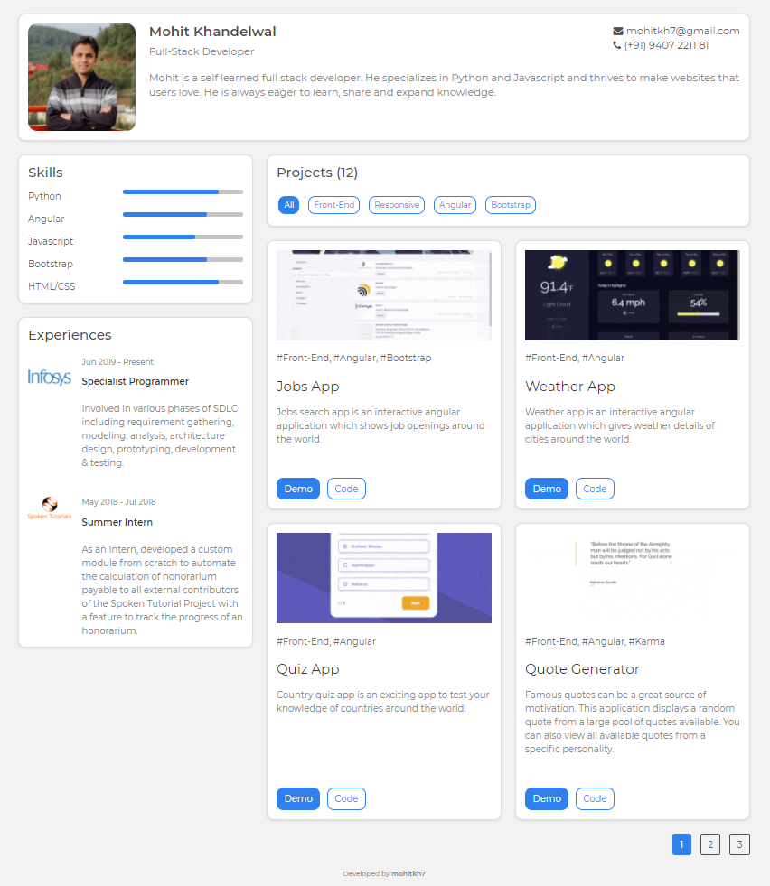

<!-- Please update value in the {}  -->

<h1 align="center">Portfolio</h1>

   Solution for a challenge from  <a href="http://devchallenges.io" target="_blank">Devchallenges.io</a>.

  <h3>
    <a href="https://mohitkh7-devchallenge-solution.web.app/responsive-web-developer/challenge8-portfolio">
      Demo
    </a>
     | 
    <a href="https://github.com/mohitkh7/devchallenges-solution/tree/master/responsive-web-developer/challenge8-portfolio">
      Solution
    </a>
     | 
    <a href="https://devchallenges.io/challenges/5ZnOYsSXM24JWnCsNFlt">
      Challenge
    </a>
  </h3>

<!-- TABLE OF CONTENTS -->

## Table of Contents

- [Overview](#overview)
  - [Built With](#built-with)
- [Features](#features)
- [Contact](#contact)
- [Acknowledgements](#acknowledgements)

<!-- OVERVIEW -->

## Overview

Portfolio web page is a great way to showcase work to the world. This portfolio page lists all solution project of devchallenges build by me. Along with projects one can also view my skills and experience.

### Built With

<!-- This section should list any major frameworks that you built your project using. Here are a few examples.-->
- [AngularJS](https://angularjs.org/)
- [Bootstrap](https://getbootstrap.com/)
- [HTML](https://developer.mozilla.org/en-US/docs/Web/HTML)
- [CSS](https://developer.mozilla.org/en-US/docs/Web/CSS)
- [JS](https://developer.mozilla.org/en-US/docs/Web/Javascript)

## Features

<!-- List the features of your application or follow the template. Don't share the figma file here :) -->

This application/site was created as a submission to a [DevChallenges](https://devchallenges.io/challenges) challenge. The [challenge](https://devchallenges.io/challenges/5ZnOYsSXM24JWnCsNFlt) was to build an application to complete the given user stories.

- [X] I can see personal details
- [X] I can see skills
- [X] I can see projects
- [X] I can filter projects by tag
- [X] I can see projects on different pages
- [X] I can see experiences

## Acknowledgements

<!-- This section should list any articles or add-ons/plugins that helps you to complete the project. This is optional but it will help you in the future. For example: -->

- [Firebase](https://firebase.google.com/) for hosting
- [Web.dev for website performance and accessibility](https://web.dev/measure/)
- [Fontawesome](https://fontawesome.com/v4.7/) for icons

## Contact

- Website [mohitkh7.github.io](http://mohitkh7.github.io/)
- GitHub [@mohitkh7](https://github.com/mohitkh7)
- Linkedin [Mohit Khandelwal](https://www.linkedin.com/in/mohitkh7)
